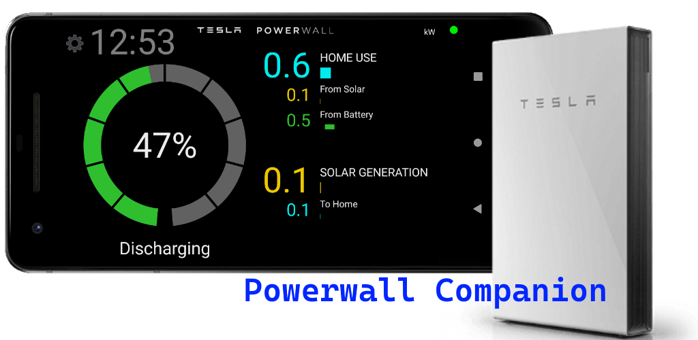

# Powerwall Companion X
Powerwall Companion X is a .NET MAUI Android app for monitoring your Tesla Powerwall 2 battery. 
It has similar functionality to the official Tesla app, but it's designed to be 
more of an "always on" dashboard, running on a spare device. 
This is an Android port of my Windows UWP version of Powerwall Companion, 
which is avaiable [here](https://github.com/tomhollander/PowerwallCompanion).

The app is available to download from Google Play [here](https://play.google.com/store/apps/details?id=com.thirtyhippos.powerwallcompanionx). 
The store is the easiest way to get the app, but I'm sharing the source in case anyone wants to improve it or is curious about the underlying APIs.

To build the app you'll also need to clone the Windows [Powerwall Companion](https://github.com/tomhollander/PowerwallCompanion) repo which contains
the shared PowerwallCompanion.Lib library. You'll also need to sign up for a developer account at https://developer.tesla.com and
add your API keys to the Secrets file.

