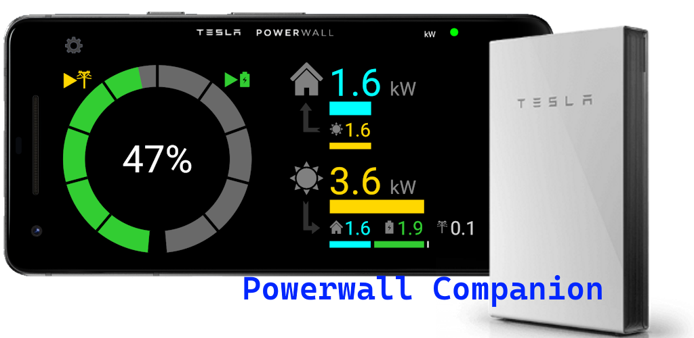

# Powerwall Companion X
Powerwall Companion X is a Xamarin Android app for monitoring your Tesla Powerwall 2 battery. 
It has similar functionality to the official Tesla app, but it's designed to be 
more of an "always on" dashboard, running on a spare device. 
This is an Android port of my older Windows UWP version of Powerwall Companion, 
which is avaiable [here](https://github.com/tomhollander/PowerwallCompanion).

The app is available to download from Google Play [here](https://play.google.com/store/apps/details?id=com.thirtyhippos.powerwallcompanionx). 
The store is the easiest way to get the app, but I'm sharing the source in case anyone wants to improve it or is curious about the underlying APIs.

